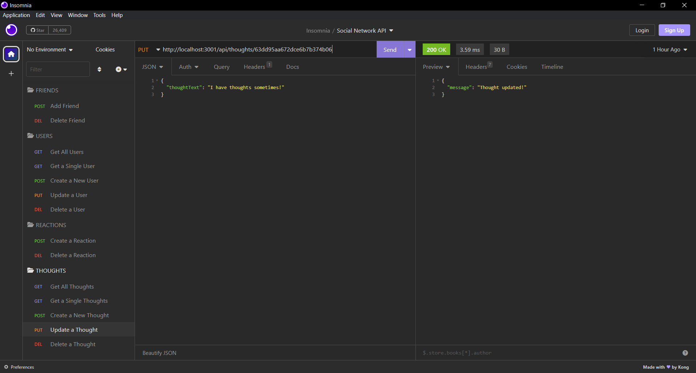

# Social Network API

## Table of Contents
- [Description](#description)
- [Instructions](#instructions)
- [Visuals](#visuals)

## Description 
This is an API for a social network web application where users can share their thoughts, react to friends’ thoughts, and create a friend list using Express.js, a MongoDB database, and the Mongoose ODM.

Features Include:
- Ability to add/delete friends. 
- Ability to get/view all users and thoughts.
- Ability to get/view individual users and thoughts.
- Ability to add new users. 
- Ability to create new thoughts tied to users. 
- Ability to update user information and thoughts.
- Ability to delete users and thoughts.  
- Ability to add/delete reactions to thoughts. 

## Instructions
- Open the "localhost:27017" connection on MongoDB Compass. 
- Run "nodemon" in the terminal to start the application. 
- Run the following routes in Insomnia:
    - Friends:
        - `/api/users/:userId/friends/:friendId` (POST/DELETE)
    - Users:
        - `/api/users` (GET ALL/POST)
        - `/api/users/:userId` (GET ONE/PUT/DELETE)
    - Reaction:
        - `/api/thoughts/:thoughtId/reactions` (POST)
        - `/api/thoughts/:thoughtId/reactions/:reactionId` (DELETE)
    - Thoughts:
        - `/api/thoughts` (GET ALL/POST)
        - `/api/thoughts/:thoughtId` (GET ONE/PUT/DELETE)

## Visuals 

The following is a link to a video demo: 
[Walkthrough Video](https://drive.google.com/file/d/1UAjVQW4YF9HPkzoRfwXon5bQTkiX-Kns/view)

The following is a screenshot of GET ALL USERS:

The following is a screenshot of GET A SINGLE USERS:

The following is a screenshot of GET ALL THOUGHTS:

The following is a screenshot of GET A SINGLE THOUGHT:

The following is a screenshot of ADD FRIEND (ADD REACTION is similar):

The following is a screenshot of DELETE FRIEND (DELETE REACTION is similar):

The following is a screenshot of CREATE A NEW USER:

The following is a screenshot of CREATE A NEW THOUGHT:

The following is a screenshot of UPDATE USER:

The following is a screenshot of UPDATE THOUGHT:

The following is a screenshot of DELETE THOUGHT (DELETE USER is similar):

The following is a screenshot of MongoDB - SocialDB.users:

The following is a screenshot of MongoDB - SocialDB.thoughts:

